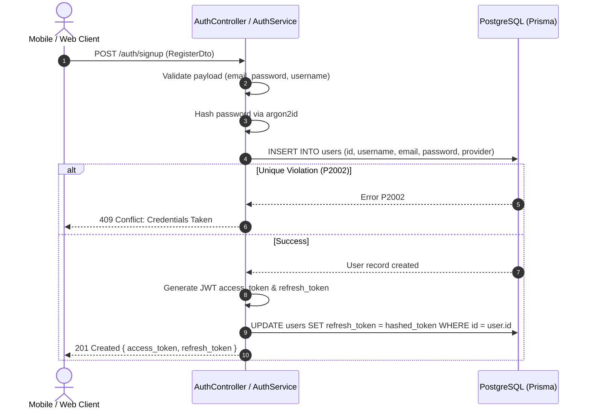
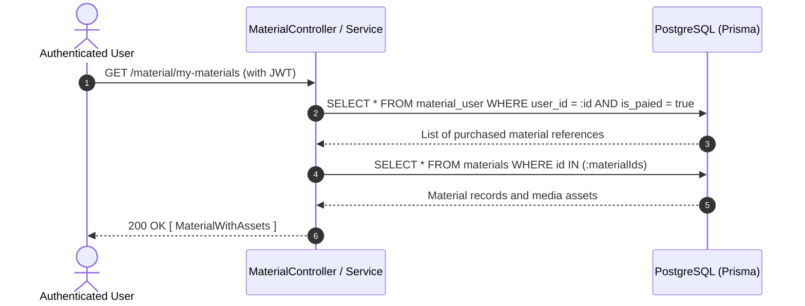

# Amped Backend Data Model & Schema Architecture

This document specifies the PostgreSQL data model managed by Prisma ORM for the Amped NestJS backend.

---

## 1. Entity-Relationship Diagram (ERD)

```mermaid
erDiagram
    USER ||--o{ PASSWORD_RESET : "requests"
    USER ||--o| PROFILE : "has"
    USER ||--o{ SELLER_PROFILE : "operates"
    USER ||--o{ MATERIAL_USER : "owns"
    USER ||--o{ RATE : "writes"
    USER ||--o{ REPORT : "files"
    USER ||--o{ SUBSCRIBED_USER : "holds"
    USER ||--o{ FAVORITE : "bookmarks"

    SELLER_PROFILE ||--o{ SOCIAL_LINKS_PROFILE : "shares"
    SELLER_PROFILE ||--o{ CHANNEL : "owns"
    SELLER_PROFILE ||--o{ MATERIAL : "publishes"
    SELLER_PROFILE ||--o{ CHANNEL_MATERIAL : "uploads"

    CHANNEL ||--o{ CHANNEL_IMAGE : "displays"
    CHANNEL ||--o{ PREVIEW_CHANNEL : "samples"
    CHANNEL ||--o{ SOCIAL_LINKS_CHANNEL : "links"
    CHANNEL ||--o{ SUBSCRIPTION_PLAN : "offers"
    CHANNEL ||--o{ FAVORITE : "favorited_by"
    CHANNEL ||--o{ RATE : "rated_by"
    CHANNEL ||--o{ REPORT : "reported_by"

    SUBSCRIPTION_PLAN ||--o{ MATERIAL_IN_SUBSCRIPTION_PLAN : "bundles"
    SUBSCRIPTION_PLAN ||--o{ SUBSCRIBED_USER : "subscribers"

    CHANNEL_MATERIAL ||--o{ CHANNEL_MATERIAL_IMAGE : "images"
    CHANNEL_MATERIAL ||--o{ CHANNEL_PREVIEW_MATERIAL : "previews"
    CHANNEL_MATERIAL ||--o{ MATERIAL_IN_SUBSCRIPTION_PLAN : "packaged_in"
    CHANNEL_MATERIAL ||--o{ FAVORITE : "favorited_by"
    CHANNEL_MATERIAL ||--o{ RATE : "rated_by"
    CHANNEL_MATERIAL ||--o{ REPORT : "reported_by"

    MATERIAL ||--o{ MATERIAL_IMAGE : "images"
    MATERIAL ||--o{ PREVIEW_MATERIAL : "previews"
    MATERIAL ||--o{ MATERIAL_USER : "purchased_by"
    MATERIAL ||--o{ FAVORITE : "favorited_by"
    MATERIAL ||--o{ RATE : "rated_by"
    MATERIAL ||--o{ REPORT : "reported_by"

    RATE ||--o{ REPLAY : "replies"

    USER {
        string id PK "UUID"
        string username UK "varchar(255)"
        string email UK "varchar(255)"
        string phone UK "varchar(255), optional"
        string password "varchar(255), argon2 hashed"
        string provider "varchar(255), default: local"
        boolean is_verified "default: false"
        boolean is_active "default: true"
        string refresh_token "varchar(255), hashed"
        datetime created_at
        datetime updated_at
    }

    PROFILE {
        int id PK "autoincrement"
        string user_id FK,UK "varchar(255)"
        string first_name "varchar(255)"
        string last_name "varchar(255)"
        enum sex "Male | Female | Unspecified"
        string date_of_birth "varchar(255)"
        string profile_image "varchar(255), optional"
        string cover_image "varchar(255), optional"
    }

    SELLER_PROFILE {
        int id PK "autoincrement"
        string user_id FK "varchar(255)"
        string name "varchar(255)"
        enum sex "Male | Female | Unspecified"
        string date_of_birth "varchar(255), optional"
        string description "text, optional"
        string image "varchar(255), optional"
        string cover_image "varchar(255), optional"
    }

    CHANNEL {
        int id PK "autoincrement"
        string name "varchar(255)"
        string description "text, optional"
        boolean draft "default: true"
        int sellerProfile_id FK
    }

    MATERIAL {
        int id PK "autoincrement"
        int sellerProfile_id FK
        enum parent "Publication | Audio | Unspecified"
        enum type "Book | Magazine | Newspaper | Audiobook | Podcast | Drama | Unspecified"
        enum genere "Psycology | Commedy | Unspecified"
        enum catagory "Fiction | Story | Documentary | Unspecified"
        string title "varchar(255)"
        string material "varchar(255)"
        float price "check: price >= 0"
        float length_minute "check: length_minute >= 0"
        float length_page "check: length_page >= 0"
    }

    SUBSCRIPTION_PLAN {
        int id PK "autoincrement"
        string name "varchar(255)"
        string description "text, optional"
        float price "check: price >= 0"
        int channel_id FK
    }

    MATERIAL_USER {
        int id PK "autoincrement"
        string user_id FK "varchar(255)"
        int material_id FK
        boolean is_paied "default: false"
    }

    RATE {
        int id PK "autoincrement"
        string user_id FK "varchar(255)"
        float rating "check: rating >= 0 AND rating <= 5"
        string remark "text"
        int material_id FK,optional
        int channel_id FK,optional
        int channel_material_id FK,optional
    }

    FAVORITE {
        int id PK "autoincrement"
        string user_id FK "varchar(255)"
        int material_id FK,optional
        int channel_id FK,optional
        int channel_material_id FK,optional
    }
```

---

## 2. Data Dictionary

### Core Tables

| Table Name | Purpose | Key Columns | Constraints & Indexes |
|---|---|---|---|
| `users` | Accounts, authentication, and credential storage. | `id` (UUID PK), `username`, `email`, `password`, `refresh_token` | `email` (UNIQUE), `username` (UNIQUE), `phone` (UNIQUE). |
| `password_resets` | Password reset tokens and OTP codes. | `id` (PK), `user_id` (FK), `reset_token`, `otp`, `expiries_at` | FK to `users(id)` ON DELETE CASCADE; Index on `user_id`. |
| `profiles` | End-user profile information. | `id` (PK), `user_id` (FK, UNIQUE), `first_name`, `last_name`, `sex` | `user_id` (UNIQUE FK to `users(id)` ON DELETE CASCADE). |
| `seller_profiles` | Creator and publisher storefront identities. | `id` (PK), `user_id` (FK), `name`, `sex`, `image`, `cover_image` | FK to `users(id)` ON DELETE CASCADE; Index on `user_id`, `name`. |
| `materials` | Standalone digital publication and audio content. | `id` (PK), `sellerProfile_id` (FK), `title`, `price`, `type`, `catagory` | FK to `seller_profiles(id)` ON DELETE CASCADE; Index on `sellerProfile_id`; CHECK constraints: `price >= 0`, `lengths >= 0`. |
| `channels` | Creator channels hosting recurring content and subscriptions. | `id` (PK), `sellerProfile_id` (FK), `name`, `draft` | FK to `seller_profiles(id)` ON DELETE CASCADE; Index on `sellerProfile_id`. |
| `channel_materials` | Episodic or serial media published within channels. | `id` (PK), `sellerProfile_id` (FK), `title`, `type`, `catagory` | FK to `seller_profiles(id)` ON DELETE CASCADE; Index on `sellerProfile_id`. |
| `subscription_plan` | Channel subscription tiers and pricing. | `id` (PK), `channel_id` (FK), `name`, `price` | FK to `channels(id)` ON DELETE CASCADE; Index on `channel_id`; CHECK constraint: `price >= 0`. |
| `material_in_subscription_plan` | Junction table associating channel materials with subscription tiers. | `id` (PK), `subscriptionPlan_id` (FK), `channelMaterial_id` (FK) | Composite UNIQUE `(subscriptionPlan_id, channelMaterial_id)`; Cascading deletes. |
| `material_user` | Purchase and ownership ledger for standalone materials. | `id` (PK), `user_id` (FK), `material_id` (FK), `is_paied` | Composite UNIQUE `(user_id, material_id)`; Cascading deletes; Index on `user_id`, `material_id`. |
| `subscribed_users` | Active channel user subscription enrollments. | `id` (PK), `user_id` (FK), `subscription_id` (FK) | Composite UNIQUE `(user_id, subscription_id)`; Cascading deletes; Index on `user_id`, `subscription_id`. |
| `ratings` | Reviews and star ratings for materials and channels. | `id` (PK), `user_id` (FK), `rating`, `remark`, target IDs | Composite UNIQUE `(user_id, material_id)`, `(user_id, channel_id)`; CHECK constraint `rating >= 0 AND rating <= 5`. |
| `replays` | Comments and replies nested under reviews. | `id` (PK), `remark_id` (FK to `ratings`), `replay` | FK to `ratings(id)` ON DELETE CASCADE; Index on `remark_id`. |
| `favorite` | User saved bookmarks and favorites. | `id` (PK), `user_id` (FK), target material/channel IDs | Composite UNIQUE `(user_id, material_id)`, `(user_id, channel_id)`; Indexes on foreign keys. |
| `reports` | Moderation flags for inappropriate content. | `id` (PK), `user_id` (FK), `report_type`, `report_desc`, target IDs | FK to `users(id)` ON DELETE CASCADE; Indexes on `user_id`, `material_id`, `channel_id`. |

---

## 3. Core Data Flows

### A. User Signup & Authentication



### B. Material Purchase & Ownership Verification



---

## 4. Data Lifecycle & Policy

### Cascading & Deletion Behavior
- **User Account Deletion**: When a `User` record is deleted (`DELETE /users/delete`), PostgreSQL foreign key cascades automatically purge associated `profiles`, `seller_profiles`, `material_user`, `ratings`, `favorites`, `subscribed_users`, and `password_resets`.
- **Seller Profile Deletion**: Cascade purges all associated `materials`, `channels`, and `channel_materials`. Associated local media files in `uploads/` are unlinked from disk by the service handler.
- **Soft Deletion**: Channels support a draft state (`draft: true/false`). Soft deletion for users or materials is not currently configured at the database level (hard deletes with cascading integrity are enforced).

### Retention & Backups (Operational Status)
- **Data Retention**: Not defined in repository codebase. Active accounts and logs persist indefinitely until explicitly purged.
- **Backup Strategy**: Recommended PostgreSQL physical and WAL archive backups (e.g. pg_dump, WAL-G, or managed provider point-in-time recovery).
- **Target Questions for Production Deployment**:
  1. What is the target RPO (Recovery Point Objective) and RTO (Recovery Time Objective) for disaster recovery?
  2. Does compliance (e.g. GDPR, local data protection) require hard anonymization of purchase history upon account closure?
